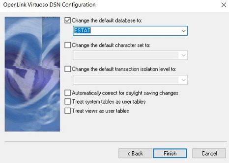
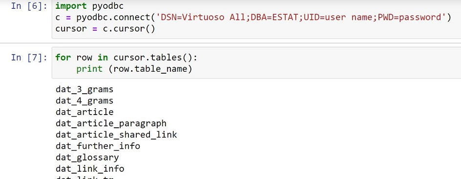

* Download the Virtuoso Open Source (VOS) for Windows distribution. Preferably version 7.2 for 64-bit machines which is available [here](https://sourceforge.net/projects/virtuoso/files/latest/download). 

. 

*  Run the installer as administrator and accept the defaults. The default installation is shown below:

. 

* With this default installation as example:
    *  Go to the **system** environment variables and add C:\Program Files\OpenLink Software\Virtuoso OpenSource 7.2\bin and C:\Program Files\OpenLink Software\Virtuoso OpenSource 7.2\lib to the system PATH variable.
    *  Crete a new **system** variable VIRTUOSO_HOME with value C:\Program Files\OpenLink Software\Virtuoso OpenSource 7.2\

* Open the ODBC Data Sources (64-bit) tool in control panel, go to Tab System DSN and create a new data source selecting the Virtuoso (Open Source) driver. Press Finish to start the configuration.

. 
 
* Fill the first configuration screen as follows. Do NOT put http:// or https:// in front of the server address.

. 

* In the next screen, fill-in your user name and password and press Next:

. 

* A connection should be established. Change the default database to ESTAT and press Finish.

. 

* Restart your system. You should be able to connect to the database using pyodbc. In the call to connect() replace "user name" and "password" with your credentials.

. 

